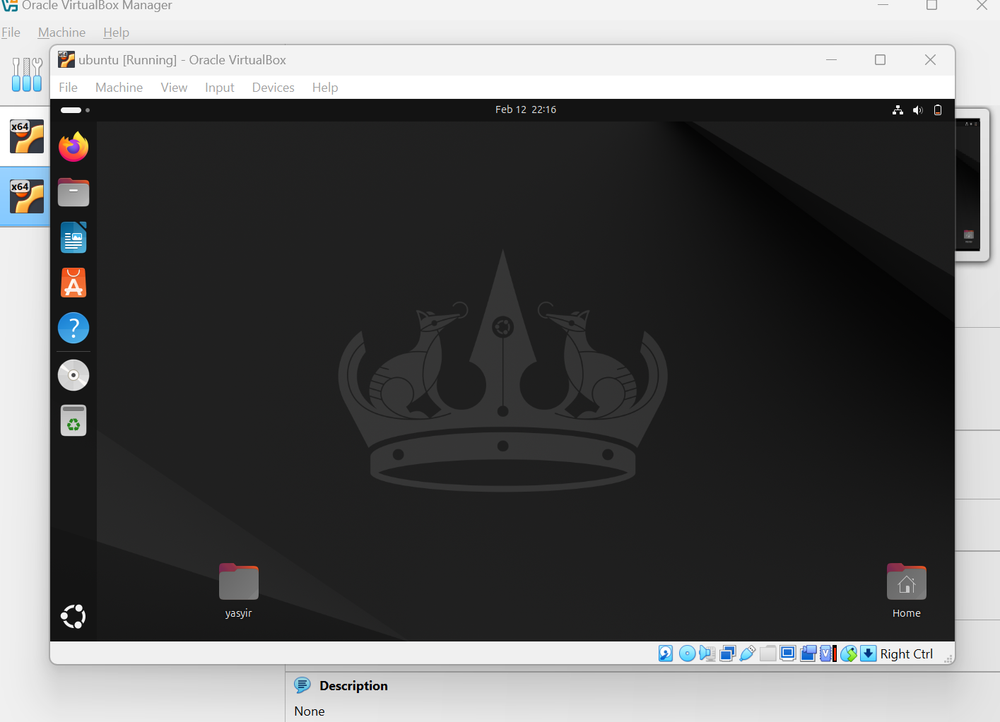

# yasyir_masyal_049_sistem_oprasi_instal_linux

  <table>
        <tr>
            <th>Nama</th>
            <td>: yasyir masy'al</td>
        </tr>
        <tr>
            <th>Kelas</th>
            <td>: Tk 4 B</td>
        </tr>
        <tr>
            <th>Nim</th>
            <td>: 09030282327049</td>
        </tr>
    </table>

<h1 style="font-weight: bold;">
 Laporan Instalasi Linux Ubuntu di VirtualBox
</h1 >

 

<h1>Alat dan Bahan</h1>
<h2>Perangkat Keras (Hardware)</h2>
<ul>
  <h3>PC/Laptop dengan spesifikasi minimal:</h3>
    
  <li>Prosesor: Intel/AMD Dual Core atau lebih tinggi</li>
  <li>RAM: 4GB (disarankan 8GB atau lebih)</li>
  <li>Penyimpanan: Minimal 20GB tersedia</li>
  
  <h3>Perangkat Lunak (Software)</h3>
    
  <li>VirtualBox (versi terbaru)</li>
  <li>File ISO Ubuntu (versi yang diinginkan, misalnya Ubuntu 22.04 LTS)</li>  
</ul>

<h2>Langkah Instalasi</h2>

<ol>
  
  <li>Buka VirtualBox dan klik "New" untuk membuat mesin virtual baru.</li>
  
  <li>Tampilan UI untuk configurasi penginstallan linux di Virtual box</li>
  
  <li>Isi nama mesin virtual (misal: "Ubuntu-VM"), pilih tipe "Linux", dan versi "Ubuntu (64-bit)", lalu configurasi seperti di gambar</li>
  
  <li>Tampilan First booting pada linux ubuntu</li>
  
  <li>Tunggu sampai Proses Installasi selesai</li>
  
  <li>Pilih User yang sudah di buat sebelumnya</li>
  
  <li>Masukan Password sesuai yang sudah di configurasi di awal</li>
  
  <li>Tampilan Screen awal Linux Ubuntu</li>
</ol>

